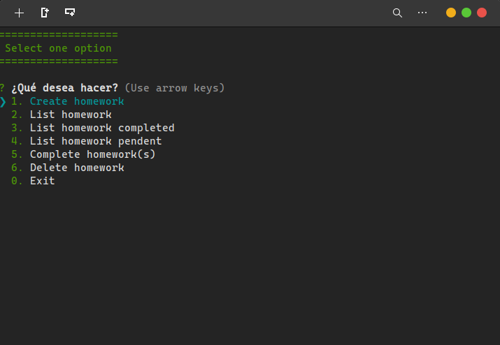

# NodeJS

### Proyecto
 

### 🔎 Cómo trabajar en este proyecto?
Crea un menu interactivo para poder administrar tus tareas, crea, completa y elimina las tareas, implementando el paquete de inquirerJS.

